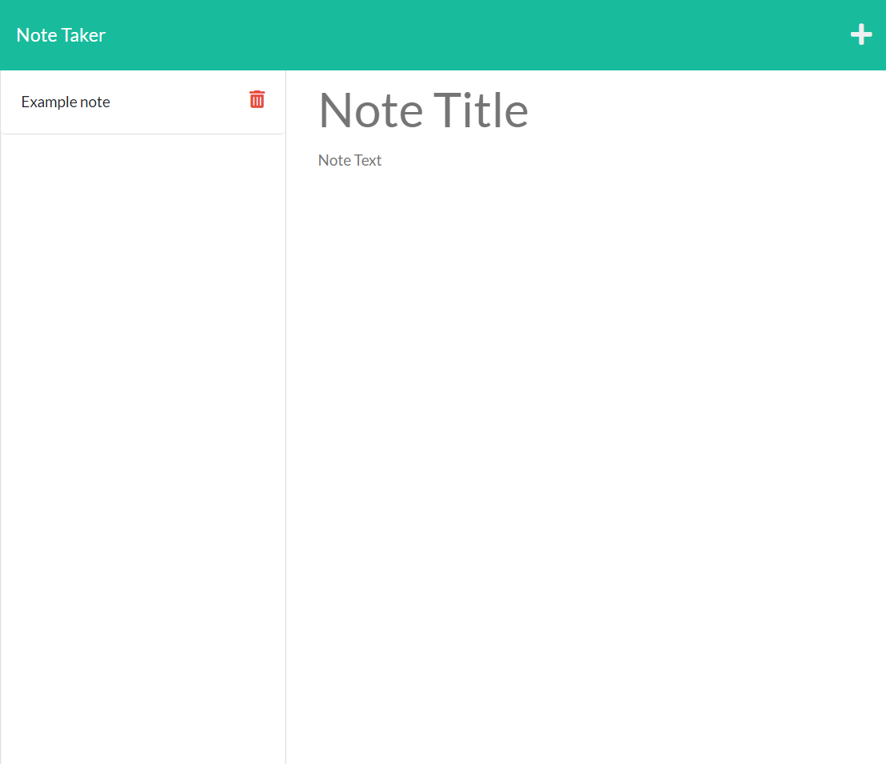

## Express Notes 
        
## Table of Contents
[Description](#description)
[Installation](#installation)
[Usage](#usage)
[Features](#features)
[Questions](#questions)

## Description
The Express Notes is an application able to save notes posted to the webpage.

## Installation
This application requires node, and is suggested to include nodemon.
    
## Usage
To use this application, type "nodemon server.js" in the terminal. Both the title and description of the note are required to post and save the data to the database. Once the server is started, use the link in the terminal to connect to the given URL.
    
## Features
The added feature to delete notes is currently a incomplete function. To delete the notes, click on the trash icon beside the posted note. However, it is deleting the notes alltogether, so be sure to only delete with caution.

## Questions
Dayne Lalmond | https://github.com/DayneLalmond
